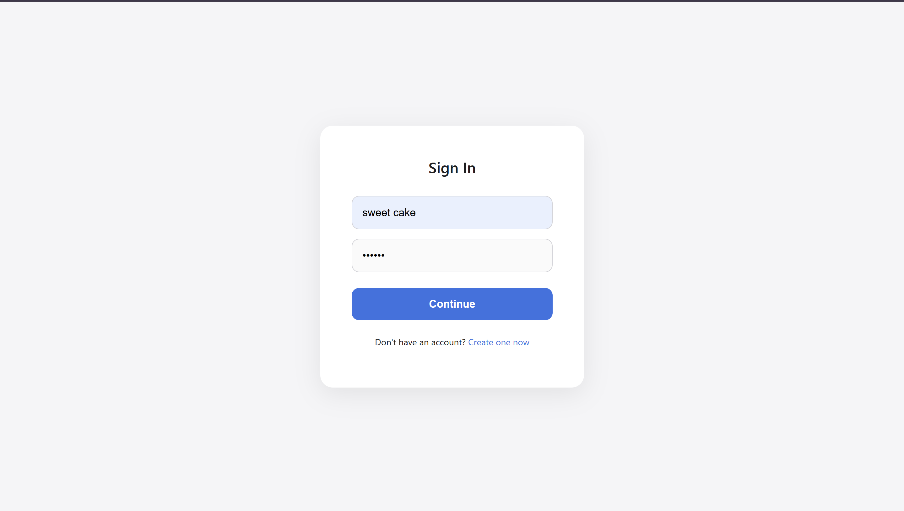
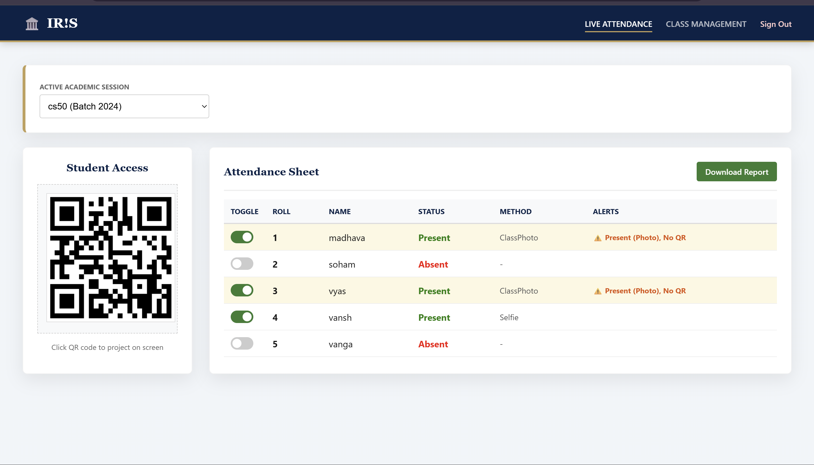
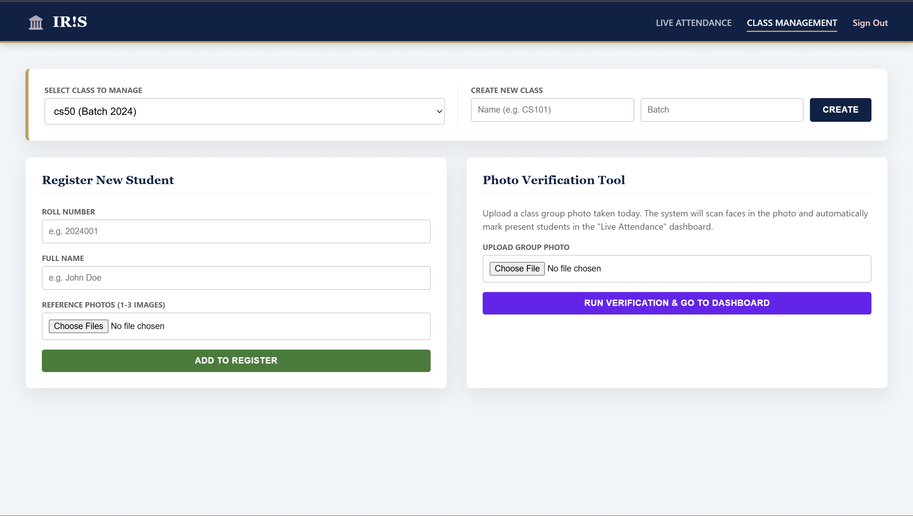
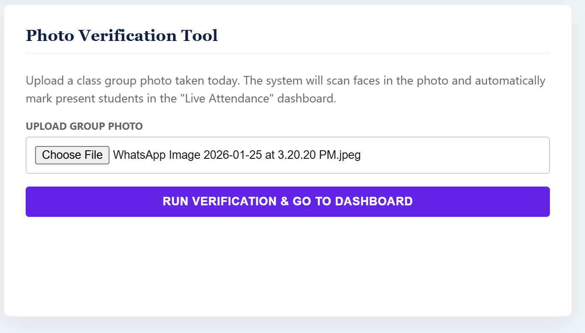
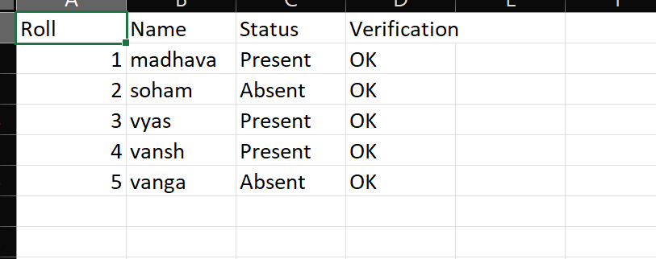
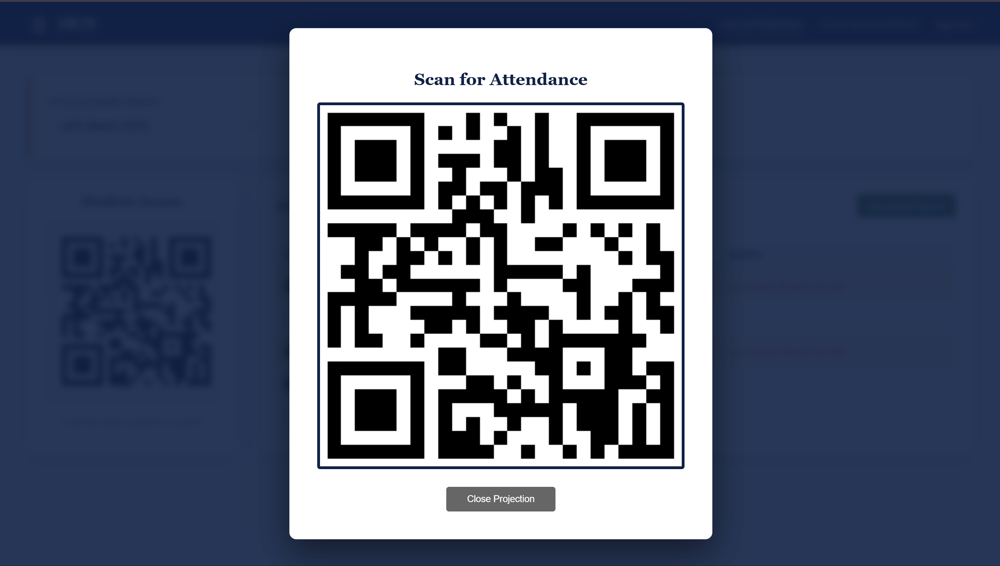
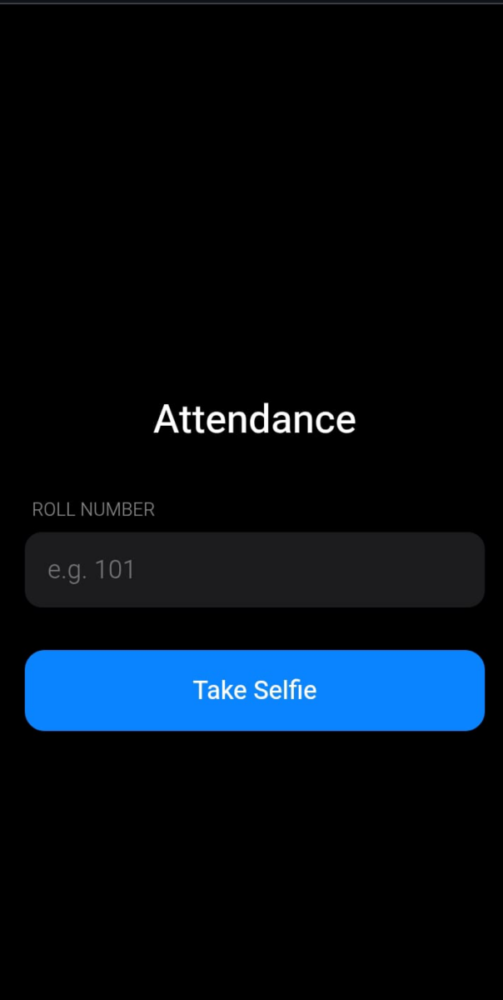
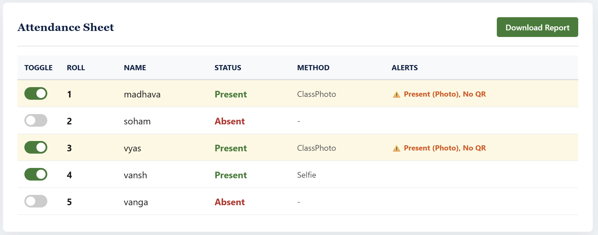

# 🏛️ IR!S | Smart Attendance System

**IR!S** is a modern, microservice-based attendance management system designed for university environments. It replaces traditional paper rolls with a contactless, AI-powered solution using facial recognition and QR codes.

The system features a professional **Professor Dashboard** for class management and live monitoring, a **GPU-accelerated AI Server** for face verification, and a mobile-friendly **Student App** for instant check-ins.

---

## System Architecture

The project uses a **Microservices Architecture** to ensure high performance and stability.

1. **Professor Dashboard (`1_prof_dash.py`)** - *Port 8000*
    - The central command center. Handles authentication, database management, and the user interface.
    - **Features:** Create classes, register students, view live attendance, toggle status manually, and export CSV reports.

2. **AI Engine (`2_gpu_server.py`)** - *Port 8001*
    - A dedicated background worker. Loads the heavy `FaceNet512` model (via DeepFace) to process selfies and group photos without slowing down the dashboard.

3. **Student App (`3_student_app.py`)** - *Port 8002*
    - A lightweight mobile web interface. Students scan a QR code projected in class to access this app, take a selfie, and get verified instantly.

---

## Installation Guide

### Prerequisites
- **Python 3.9+** installed.
- A webcam (for testing) or smartphone (for scanning).
- **Optional:** NVIDIA GPU with CUDA (System runs on CPU by default).

### Setup
1. **Clone or Download** this repository.
2. **Create a Virtual Environment** (Recommended):
    ```bash
    python -m venv venv
    # Windows:
    .\venv\Scripts\activate
    # Mac/Linux:
    source venv/bin/activate
    ```
3. **Install Dependencies**:
    ```bash
    pip install -r requirements.txt
    ```

### Critical Network Configuration
For students to scan the QR code with their phones, you must configure your IP address.
1. Open Command Prompt/Terminal and run `ipconfig` (Windows) or `ifconfig` (Mac).
2. Copy your **IPv4 Address** (e.g., `192.168.1.15`).
3. Open `1_prof_dash.py`, find **Line 140** (approx), and update:
    ```python
    "student_url": "http://192.168.1.XX:8002"  # <-- Replace with YOUR IP
    ```

---

## Usage Instructions

You must run **three separate terminal windows** to start the full system.

### Step 1: Start the AI Server
```bash
python 2_gpu_server.py
```
Wait for: Uvicorn running on http://0.0.0.0:8001

### Step 2: Start the Student App
```bash
python 3_student_app.py
```
Wait for: Uvicorn running on http://0.0.0.0:8002

### Step 3: Start the Main Dashboard
```bash
python 1_prof_dash.py
```
Wait for: Uvicorn running on http://0.0.0.0:8000

### Step 4: Login
Open your browser to http://localhost:8000 and register a new account.


---

## Workflow Guide

1. **Class Management Tab**
    - **Create Class:** Set up a new subject (e.g., "CS101", Batch "2024").
    
    - **Register Student:** Enter Roll No & Name, and upload 1-3 clear photos of the student.
    
    - **Photo Verification:** Upload a group photo of the entire class. The AI will scan faces and auto-mark attendance for anyone found in the photo.
    
    

2. **Live Attendance Tab**
    - **Project QR Code:** Click the QR thumbnail to expand it fullscreen on the projector.
    
    - **Student Scan:** Students scan the QR → Take a Selfie → Get Verified.
    
    - **Live Updates:** The dashboard updates automatically (turning rows green) as students check in.
    
    - **Manual Override:** Use the toggle switches to manually mark a student Present/Absent if needed.
    
    - **Export Data:** Download the daily attendance report as a CSV file.
    

---

## Database Structure

The system uses SQLModel (SQLite) for data and a structured file system for images.

```
attendance/
│
├── student_db/                 <-- Training Photos Storage
│   └── [Class_Name]/
│       └── stu_[Roll_No]/      <-- Individual Student Photos
│
├── prof_db/                    <-- Reports Storage
│   └── prof_[ID]/
│       └── [Class_Name]/       <-- Generated CSV Reports
│
├── main_app.db                 <-- SQLite Database File
├── templates/                  <-- HTML UI Files
└── static/                     <-- Assets Folder
```

---

## Troubleshooting

**Q: The QR Code link says "Site Can't Be Reached" on mobile.**
- Fix 1: Ensure both laptop and phone are on the same Wi-Fi.
- Fix 2: Use a Mobile Hotspot from your phone to bypass router isolation.
- Fix 3: Turn off Windows Firewall temporarily.

**Q: "Internal Server Error" when registering.**
- Fix: You might be missing a library or have a corrupted DB.
  - Run `pip install python-multipart`.
  - Delete `main_app.db`.
  - Restart `1_prof_dash.py`.

**Q: The AI is slow.**
- Fix: Face recognition is heavy. On a CPU, it may take 1-3 seconds per verification. For instant results, run on a machine with an NVIDIA GPU.
